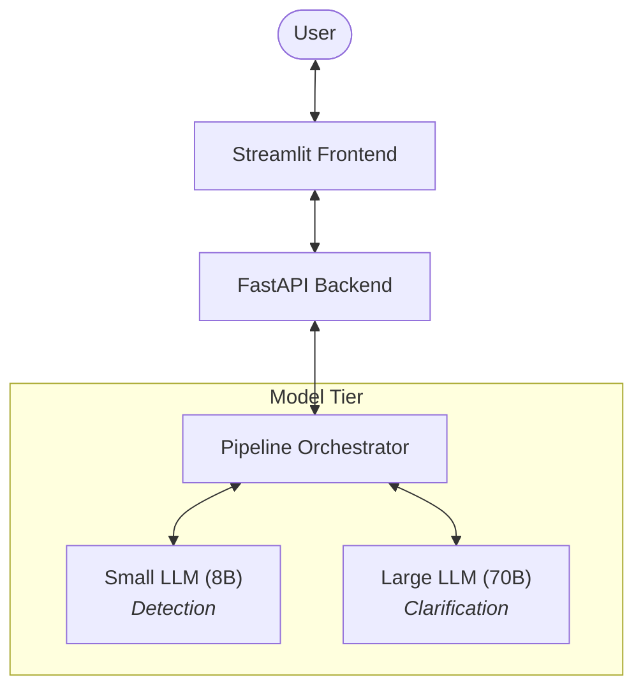

# ClariGen: Ambiguity Detection and Clarification System

ClariGen is a multi-model pipeline designed to detect ambiguous user queries and generate precise clarifying questions. It leverages a tiered LLM approach to balance speed and intelligence.

## Architecture



## Quick Start

Get ClariGen up and running in three steps:

### 1. Set Up Environment
```bash
# Clone and enter the repo
cp .env.example .env
# Edit .env and set your model URLs and API keys
```

### 2. Start Model Servers
ClariGen requires two model servers (port 8368 and 8369 by default).
```bash
cd llm_hosting
./serve_models.sh  # Requires vLLM and GPUs
```
*See [LLM Hosting](llm_hosting/README.md) for remote setup or alternative hosting.*

### 3. Launch Applications
Run the backend and frontend in separate terminals:
```bash
# Terminal A: Start API
uvicorn apps.api.main:app --port 8370

# Terminal B: Start UI
streamlit run apps/frontend/app.py --server.port 8501
```

---

## Project Structure

- [**Core Library**](core/README.md): The heart of ClariGen (Detection & Orchestration).
- [**API Backend**](apps/api/README.md): FastAPI service providing programmatic access.
- [**Frontend**](apps/frontend/README.md): Streamlit-based interactive playground.
- [**Model Hosting**](llm_hosting/README.md): Scripts for serving Llama-3 models via vLLM.
- [**Deployment**](deployment/README.md): Docker and SSH tunnel configurations for production-like setups.
- [**Evaluation**](evaluation/README.md): Tools to measure system performance on benchmark datasets.

## Configuration

Detailed environment settings can be found in [ENVIRONMENT.md](docs/ENVIRONMENT.md).

**Key Settings:**
- `CLARIFICATION_STRATEGY`: `at_standard` (default), `at_cot` (advanced), or `vanilla`.
- `MAX_CLARIFICATION_ATTEMPTS`: Limits the iteration count.

## License

Copyright © 2025, Wireless System Research Group (WiSeR), McMaster University.
Licensed under [CC BY-NC 4.0](https://creativecommons.org/licenses/by-nc/4.0/). See the full license details in the [root README](README.md#L182).

