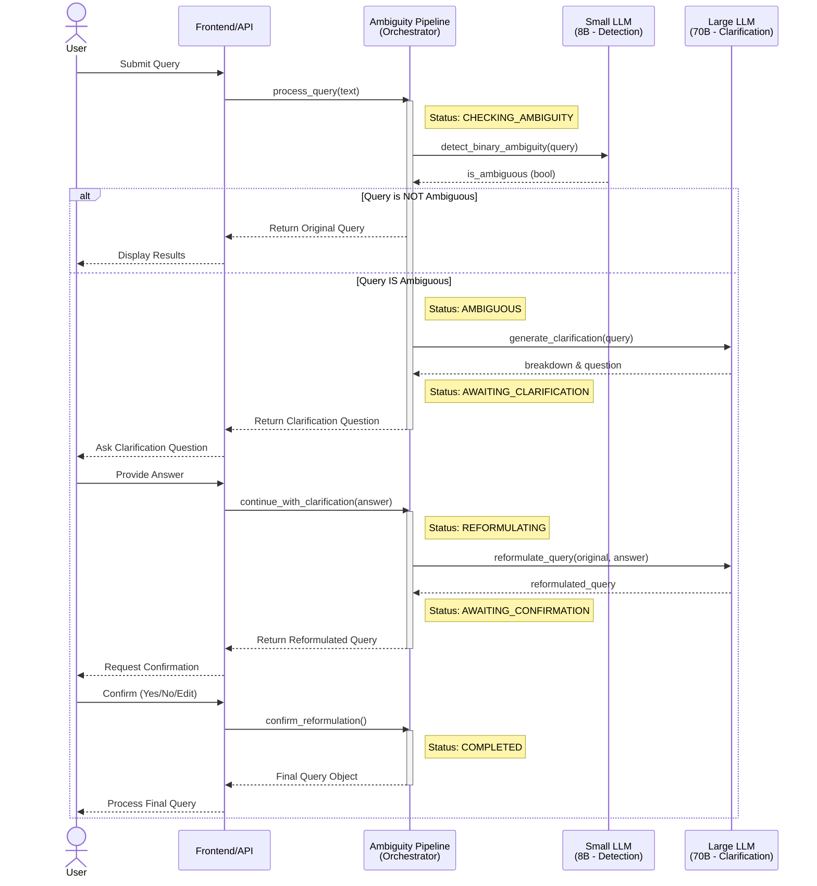
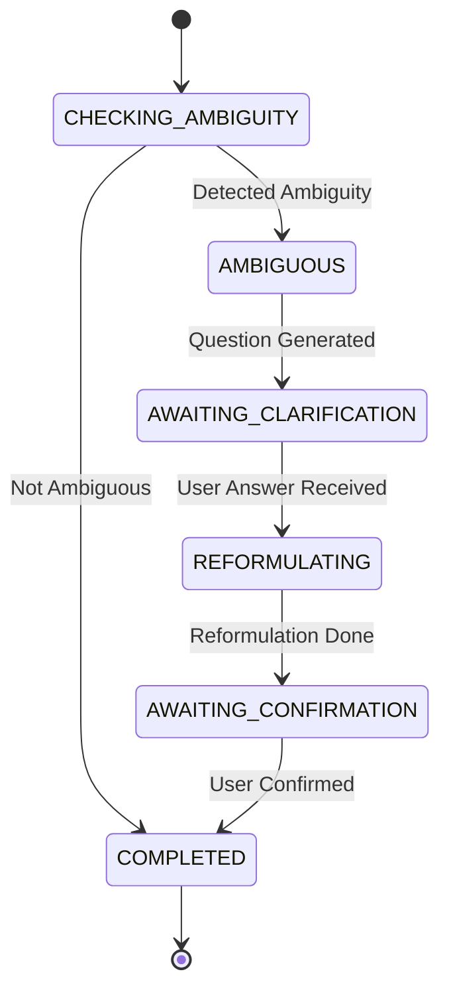

# ClariGen System Architecture

This document outlines the architecture of ClariGen, detailing the interaction flow and the state transitions of a query.

## 1. System Interaction Flow (Sequence Diagram)

This sequence diagram illustrates exactly how a user query is processed, showing the interactions between the User, the Orchestrator (Ambiguity Pipeline), and the Model Clients.

## 2. Query Lifecycle (State Diagram)

The `Query` object transitions through several states managed by the pipeline.

## 3. Key Components

*   **AmbiguityPipeline**: The central controller defined in `ambiguity_pipeline.py`. It manages the `Query` object and coordinates calls to the models.
*   **SmallModelClient**: Specialized for speed. It uses the 8B model solely for the binary decision: "Is this ambiguous?".
*   **LargeModelClient**: Specialized for reasoning. It uses the 70B model to understand *why* it's ambiguous, generate a precise question, and rewrite the query based on the answer.
